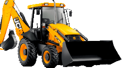

<!DOCTYPE html>
<html lang="en">

<head>
  <meta charset="UTF-8">
  <meta name="viewport" content="width=device-width, initial-scale=1.0">
  <title>Успех и дело</title>
  <link href="https://fonts.googleapis.com/css2?family=Lato:ital,wght@0,400;0,700;0,900;1,700&display=swap"
    rel="stylesheet">
  <link rel="stylesheet" href="https://maxcdn.bootstrapcdn.com/bootstrap/3.3.7/css/bootstrap.min.css"
    integrity="sha384-BVYiiSIFeK1dGmJRAkycuHAHRg32OmUcww7on3RYdg4Va+PmSTsz/K68vbdEjh4u" crossorigin="anonymous">
  <link rel="stylesheet" href="css/style.css">
</head>

<body>
  
  <a href="#object1.html">object</a>
  <a href="object2.html">object2</a>
  <a href="partnership.html">partnership</a>
  <a href="map.html">map</a>
  <main class="main">
    

      

        

          

            <input type="text" class="form-control" placeholder="Какие работы интересуют?">
            
              <button class="btn btn-orange"><i class="fas fa-search"></i>Найти</button>
            
          

          <!-- /input-group -->
        

        

          

            <!--    <a href="map.html">
                <select name="select" id="sel1" class="form-control select-region"></select>
              </a> -->
            <select class="form-control select-region"></select>

            <ul class="dropdown map-dropdown">
              <li></li>
              <li class="dropdown-header">
                <input type="checkbox" id="central" class="parent-checkbox map-checkbox">
                <label for="central" class="d-block">
                  Центальный  федеральный округ
                </label>
                <ul class="dropdown-child">
                  <li>
                    <input type="checkbox" id="msc" name="map-checkbox" class="map-checkbox">
                    <label for="msc">Москва</label>
                  </li>
                  <li>
                    <input type="checkbox" id="bel" name="map-checkbox" class="map-checkbox">
                    <label for="bel">Белгородская область</label>
                  </li>
                  <li>
                    <input type="checkbox" id="bryansk" name="map-checkbox" class="map-checkbox">
                    <label for="bryansk">Брянская область</label>
                  </li>
                  <li>
                    <input type="checkbox" id="vladimir" name="map-checkbox" class="map-checkbox">
                    <label for="vladimir">Владимирская область</label>
                  </li>
                  <li>
                    <input type="checkbox" id="voronezh" name="map-checkbox" class="map-checkbox">
                    <label for="voronezh">Воронежская область</label>
                  </li>
                  <li>
                    <input type="checkbox" id="ivanovsk" name="map-checkbox" class="map-checkbox">
                    <label for="ivanovsk">Ивановская область</label>
                  </li>
                  <li>
                    <input type="checkbox" id="kaluga" name="map-checkbox" class="map-checkbox">
                    <label for="kaluga">Калужская область</label>
                  </li>
                  <li>
                    <input type="checkbox" id="kostr" name="map-checkbox" class="map-checkbox">
                    <label for="kostr">Костромская область</label>
                  </li>
                  <li>
                    <input type="checkbox" id="kursk" name="map-checkbox" class="map-checkbox">
                    <label for="kursk">Курская область</label>
                  </li>
                  <li>
                    <input type="checkbox" id="lipetsk" name="map-checkbox" class="map-checkbox">
                    <label for="lipetsk">Липецкая область</label>
                  </li>
                  <li>
                    <input type="checkbox" id="moscowskaya" name="map-checkbox" class="map-checkbox">
                    <label for="moscowskaya">Московская область</label>
                  </li>
                  <li>
                    <input type="checkbox" id="orel" name="map-checkbox" class="map-checkbox">
                    <label for="orel">Орловская область</label>
                  </li>
                </ul>
              </li>
              <li class="dropdown-header">
                <input type="checkbox" id="southern" class="parent-checkbox map-checkbox">
                <label for="southern" class="d-block">
                  Южный  федеральный округ
                </label>
                <ul class="dropdown-child">
                  <li>
                    <input type="checkbox" id="adygeya" name="map-checkbox" class="map-checkbox">
                    <label for="adygeya">Республика Адыгея</label>
                  </li>
                  <li>
                    <input type="checkbox" id="kalmyk" name="map-checkbox" class="map-checkbox">
                    <label for="kalmyk">Республика Калмыкия</label>
                  </li>
                  <li>
                    <input type="checkbox" id="krym" name="map-checkbox" class="map-checkbox">
                    <label for="krym">Республика Крым</label>
                  </li>
                  <li>
                    <input type="checkbox" id="krasnodar" name="map-checkbox" class="map-checkbox">
                    <label for="krasnodar">Краснодарский край</label>
                  </li>
                  <li>
                    <input type="checkbox" id="astrah" name="map-checkbox" class="map-checkbox">
                    <label for="astrah">Астраханская область</label>
                  </li>
                  <li>
                    <input type="checkbox" id="volgograd" name="map-checkbox" class="map-checkbox">
                    <label for="volgograd">Волгоградская область</label>
                  </li>
                  <li>
                    <input type="checkbox" id="rostov" name="map-checkbox" class="map-checkbox">
                    <label for="rostov">Ростовская область</label>
                  </li>
                  <li>
                    <input type="checkbox" id="sevast" name="map-checkbox" class="map-checkbox">
                    <label for="sevast">Севастополь</label>
                  </li>
                </ul>
              </li>
              <li class="dropdown-header">
                <input type="checkbox" id="north-west" class="parent-checkbox map-checkbox">
                <label for="north-west" class="d-block">
                  Северо-Западный  федеральный округ
                </label>
                <ul class="dropdown-child">
                  <li>
                    <input type="checkbox" id="spb" name="map-checkbox" class="map-checkbox">
                    <label for="spb">Санкт-Петербург</label>
                  </li>
                  <li>
                    <input type="checkbox" id="korelia" name="map-checkbox" class="map-checkbox">
                    <label for="korelia">Республика Карелия</label>
                  </li>
                  <li>
                    <input type="checkbox" id="komi" name="map-checkbox" class="map-checkbox">
                    <label for="komi">Республика Коми</label>
                  </li>
                  <li>
                    <input type="checkbox" id="arh" name="map-checkbox" class="map-checkbox">
                    <label for="arh"> Архангельская область</label>
                  </li>
                  <li>
                    <input type="checkbox" id="volg" name="map-checkbox" class="map-checkbox">
                    <label for="volg">Вологодская область</label>
                  </li>
                  <li>
                    <input type="checkbox" id="kalinin" name="map-checkbox" class="map-checkbox">
                    <label for="kalinin">Калининградская область</label>
                  </li>
                  <li>
                    <input type="checkbox" id="lenin" name="map-checkbox" class="map-checkbox">
                    <label for="lenin">Ленинградская область</label>
                  </li>
                  <li>
                    <input type="checkbox" id="murm" name="map-checkbox" class="map-checkbox">
                    <label for="murm">Мурманская область</label>
                  </li>
                  <li>
                    <input type="checkbox" id="novg" name="map-checkbox" class="map-checkbox">
                    <label for="novg">Новгородская область</label>
                  </li>
                  <li>
                    <input type="checkbox" id="pskov" name="map-checkbox" class="map-checkbox">
                    <label for="pskov">Псковская область</label>
                  </li>
                  <li>
                    <input type="checkbox" id="nenez" name="map-checkbox" class="map-checkbox">
                    <label for="nenez">Ненецкий автономный округ</label>
                  </li>
                </ul>
              </li>
              <li class="dropdown-header">
                <input type="checkbox" id="privolzhskiy" class="parent-checkbox map-checkbox">
                <label for="privolzhskiy" class="d-block">
                  Приволжский  федеральный округ
                </label>
                <ul class="dropdown-child">
                  <li>
                    <input type="checkbox" id="bash" name="map-checkbox" class="map-checkbox">
                    <label for="bash">Башкортостан</label>
                  </li>
                  <li>
                    <input type="checkbox" id="mariy" name="map-checkbox" class="map-checkbox">
                    <label for="mariy">Республика Марий Эл</label>
                  </li>
                  <li>
                    <input type="checkbox" id="mord" name="map-checkbox" class="map-checkbox">
                    <label for="mord">Мордовия</label>
                  </li>
                  <li>
                    <input type="checkbox" id="tatar" name="map-checkbox" class="map-checkbox">
                    <label for="tatar">Татарстан</label>
                  </li>
                  <li>
                    <input type="checkbox" id="volg" name="map-checkbox" class="map-checkbox">
                    <label for="volg">Вологодская область</label>
                  </li>
                  <li>
                    <input type="checkbox" id="udm" name="map-checkbox" class="map-checkbox">
                    <label for="udm">Удмуртия</label>
                  </li>
                  <li>
                    <input type="checkbox" id="chuv" name="map-checkbox" class="map-checkbox">
                    <label for="chuv">Чувашия </label>
                  </li>
                  <li>
                    <input type="checkbox" id="murm" name="map-checkbox" class="map-checkbox">
                    <label for="murm">Мурманская область</label>
                  </li>
                  <li>
                    <input type="checkbox" id="perm" name="map-checkbox" class="map-checkbox">
                    <label for="perm">Пермский край</label>
                  </li>
                  <li>
                    <input type="checkbox" id="kirov" name="map-checkbox" class="map-checkbox">
                    <label for="kirov">Кировская область</label>
                  </li>
                  <li>
                    <input type="checkbox" id="nizhe" name="map-checkbox" class="map-checkbox">
                    <label for="nizhe">Нижегородская область</label>
                  </li>
                  <li>
                    <input type="checkbox" id="oren" name="map-checkbox" class="map-checkbox">
                    <label for="oren">Оренбургская область</label>
                  </li>
                  <li>
                    <input type="checkbox" id="penza" name="map-checkbox" class="map-checkbox">
                    <label for="penza">Пензенская область</label>
                  </li>
                  <li>
                    <input type="checkbox" id="samara" name="map-checkbox" class="map-checkbox">
                    <label for="samara">Самарская область</label>
                  </li>
                </ul>
              </li>

              <li class="dropdown-header">
                <input type="checkbox" id="uralskiy" class="parent-checkbox map-checkbox">
                <label for="uralskiy" class="d-block">
                  Уральский  федеральный округ
                </label>
                <ul class="dropdown-child">
                  <li>
                    <input type="checkbox" id="kurgan" name="map-checkbox" class="map-checkbox">
                    <label for="kurgan">Курганская область</label>
                  </li>
                  <li>
                    <input type="checkbox" id="sverdlovsk" name="map-checkbox" class="map-checkbox">
                    <label for="sverdlovsk">Свердловская область</label>
                  </li>
                  <li>
                    <input type="checkbox" id="tumen" name="map-checkbox" class="map-checkbox">
                    <label for="tumen">Тюменская область</label>
                  </li>
                  <li>
                    <input type="checkbox" id="chel" name="map-checkbox" class="map-checkbox">
                    <label for="chel">Челябинская область</label>
                  </li>
                  <li>
                    <input type="checkbox" id="ugra" name="map-checkbox" class="map-checkbox">
                    <label for="ugra">Югра</label>
                  </li>
                  <li>
                    <input type="checkbox" id="yamal" name="map-checkbox" class="map-checkbox">
                    <label for="kyamal">Ямало-Ненецкий автономный округ</label>
                  </li>
                </ul>
              </li>
              <li class="dropdown-header">
                <input type="checkbox" id="siberian" class="parent-checkbox map-checkbox">
                <label for="siberian" class="d-block">
                  Сибирский  федеральный округ
                </label>
                <ul class="dropdown-child">
                  <li>
                    <input type="checkbox" id="altay" name="map-checkbox" class="map-checkbox">
                    <label for="altay">Алтай</label>
                  </li>
                  <li>
                    <input type="checkbox" id="tyva" name="map-checkbox" class="map-checkbox">
                    <label for="tyva">Республика Тыва</label>
                  </li>
                  <li>
                    <input type="checkbox" id="hak" name="map-checkbox" class="map-checkbox">
                    <label for="hak">Хакасия</label>
                  </li>
                  <li>
                    <input type="checkbox" id="alt" name="map-checkbox" class="map-checkbox">
                    <label for="alt">Алтайский край</label>
                  </li>
                  <li>
                    <input type="checkbox" id="krasnoyarsk" name="map-checkbox" class="map-checkbox">
                    <label for="krasnoyarsk">Красноярский край</label>
                  </li>
                  <li>
                    <input type="checkbox" id="irkutsk" name="map-checkbox" class="map-checkbox">
                    <label for="irkutsk">Иркутская область</label>
                  </li>
                  <li>
                    <input type="checkbox" id="kemerovo" name="map-checkbox" class="map-checkbox">
                    <label for="kemerovo">Кемеровская область</label>
                  </li>
                  <li>
                    <input type="checkbox" id="novosib" name="map-checkbox" class="map-checkbox">
                    <label for="novosib">Новосибирская область</label>
                  </li>
                  <li>
                    <input type="checkbox" id="omsk" name="map-checkbox" class="map-checkbox">
                    <label for="nomsk">Омская область</label>
                  </li>
                  <li>
                    <input type="checkbox" id="tomsk" name="map-checkbox" class="map-checkbox">
                    <label for="tomsk">Томская область</label>
                  </li>
                </ul>
              </li>

              <li class="dropdown-header">
                <input type="checkbox" id="north-kavkasian" class="parent-checkbox map-checkbox">
                <label for="north-kavkasian" class="d-block">
                  Северо-Кавказский  федеральный округ
                </label>
                <ul class="dropdown-child">
                  <li>
                    <input type="checkbox" id="dag" name="map-checkbox" class="map-checkbox">
                    <label for="dag">Дагестан</label>
                  </li>
                  <li>
                    <input type="checkbox" id="ingush" name="map-checkbox" class="map-checkbox">
                    <label for="ingush">Ингушетия</label>
                  </li>
                  <li>
                    <input type="checkbox" id="kabardin" name="map-checkbox" class="map-checkbox">
                    <label for="kabardin">Кабардино-Балкария</label>
                  </li>
                  <li>
                    <input type="checkbox" id="karach" name="map-checkbox" class="map-checkbox">
                    <label for="karach">Карачаево-Черкесия</label>
                  </li>
                  <li>
                    <input type="checkbox" id="oset" name="map-checkbox" class="map-checkbox">
                    <label for="oset">Северная Осетия</label>
                  </li>
                  <li>
                    <input type="checkbox" id="chechen" name="map-checkbox" class="map-checkbox">
                    <label for="chechen">Чеченская Республика</label>
                  </li>
                  <li>
                    <input type="checkbox" id="stavr" name="map-checkbox" class="map-checkbox">
                    <label for="stavr">Ставропольский край </label>
                  </li>
                </ul>
              </li>

              <li class="dropdown-header">
                <input type="checkbox" id="far-eastern" class="parent-checkbox map-checkbox">
                <label for="far-eastern" class="d-block">
                  Дальневосточный  федеральный округ
                </label>
                <ul class="dropdown-child">
                  <li>
                    <input type="checkbox" id="bur" name="map-checkbox" class="map-checkbox">
                    <label for="bur">Бурятия</label>
                  </li>
                  <li>
                    <input type="checkbox" id="yakut" name="map-checkbox" class="map-checkbox">
                    <label for="yakut">Якутия</label>
                  </li>
                  <li>
                    <input type="checkbox" id="zabayk" name="map-checkbox" class="map-checkbox">
                    <label for="zabayk">Забайкальский край</label>
                  </li>
                  <li>
                    <input type="checkbox" id="kamchatka" name="map-checkbox" class="map-checkbox">
                    <label for="kamchatka">Камчатский край</label>
                  </li>
                  <li>
                    <input type="checkbox" id="primor" name="map-checkbox" class="map-checkbox">
                    <label for="primor">Приморский край</label>
                  </li>
                  <li>
                    <input type="checkbox" id="hab" name="map-checkbox" class="map-checkbox">
                    <label for="hab">Хабаровский край</label>
                  </li>
                  <li>
                    <input type="checkbox" id="amur" name="map-checkbox" class="map-checkbox">
                    <label for="amur">Амурская область</label>
                  </li>
                  <li>
                    <input type="checkbox" id="magadan" name="map-checkbox" class="map-checkbox">
                    <label for="magadan">Магаданская область</label>
                  </li>
                </ul>
              </li>
            </ul>
          

        

      

    

    <!-- search -->
    

      

        

          
          
Подключите тариф,чтобы получить доступ к контактам победителей тендеров
            и
            заказчиков строительных работ
          

        

      

      

        <button class="btn btn-light">Подключить <svg width="8" height="12" viewBox="0 0 8 12" fill="none"
            xmlns="http://www.w3.org/2000/svg">
            <g clip-path="url(#clip0)">
              <path
                d="M0.592391 0.19229L0.196583 0.585362C0.0729715 0.70907 0.00488351 0.873662 0.00488352 1.04957C0.00488353 1.22538 0.0729835 1.39015 0.196596 1.51386L4.68072 5.99779L0.191616 10.4869C0.0680039 10.6104 -5.35591e-08 10.7752 -4.58741e-08 10.951C-3.81892e-08 11.1268 0.068004 11.2917 0.191616 11.4153L0.584976 11.8085C0.84078 12.0645 1.25747 12.0645 1.51327 11.8085L6.87732 6.46366C7.00084 6.34014 7.08786 6.17556 7.08786 5.99819L7.08786 5.99614C7.08786 5.82023 7.00074 5.65565 6.87732 5.53213L1.52782 0.19229C1.4043 0.0685825 1.23474 0.000674194 1.05894 0.000482513C0.883031 0.000482521 0.715811 0.0685825 0.592391 0.19229Z"
                fill="#FFC329" />
            </g>
            <defs>
              <clipPath id="clip0">
                <rect y="12" width="12" height="7.08786" transform="rotate(-90 0 12)" fill="white" />
              </clipPath>
            </defs>
          </svg>
        </button>
      

    

    <!-- warning -->
    

      

        
      

      

        

          <h3 class="excavator-heading">Для тех, кто копает глубже и хочет знать больше!</h3>
          
Подписывайтесь, если хотите быть в курсе последних событий в сфере гос.
            закупок
          

        

      

      

        

          <button class="btn btn-noir"><i class="far fa-envelope"></i>Подписаться на новости</button>
        

      

    

    <!-- excavator -->
    

      <input type="checkbox" id="service-card" class="d-none">
      <label for="service-card" class="col-lg-12">
        <table class="table table-index">
          <thead>
            <tr class="table-head">
              <td><i class="fas fa-star"></i><b>№</b>6545</td>
              <td class="table-name"><i class="fas fa-bookmark"></i>Бригада электромонтажников</td>
              <td><i class="far fa-clock"></i>Дата10.05.2020</td>
            </tr>
          </thead>
          <tbody>
            <tr class="table-body">
              <td class="table-heading"><i class="fas fa-cog"></i>Вид работ:</td>
              <td class="table-data">Прокладка</td>
              <td></td>
            </tr>
            <tr class="table-body">
              <td class="table-heading"><i class="fas fa-map-marker-alt"></i>Место выполнения:</td>
              <td class="table-data">Красноярский край, Ачинск</td>
              <td></td>
            </tr>
            <tr class="table-body">
              <td class="table-heading"><i class="fas fa-clipboard-list"></i>Описание:</td>
              <td class="table-data">Прокладка, расключка силового кабеля</td>
              <td></td>
            </tr>
          </tbody>
        </table>
        

          

            <button class="btn btn-light-yellow">Открыть контакты</button>
          

          

            

              * Для безлимитного доступа к контактам (сотовый
                телефон, e-mail) заказчика <a href="#">оформите
                подписку</a>
            

          

      </label>

    

    <!-- contacts -->
    

    <!-- service-card -->

    <section class="pagination-section d-flex justify-content-btw">
      

        <nav aria-label="Page navigation">
          <ul class="pagination">
            <li>
              <a href="#" aria-label="First">
                
              </a>
            </li>
            <li>
              <a href="#" aria-label="Previous" class="arrow">
                
              </a>
            </li>
            <li><a href="#">1</a></li>
            <li><a href="#">2</a></li>
            <li><a href="#">3</a></li>
            <li><a href="#">4</a></li>
            <li><a href="#">5</a></li>
            <li>
              <a href="#" aria-label="Next" class="arrow">
                ">
              </a>
            </li>
            <li>
              <a href="#" aria-label="Last">
                ">
              </a>
            </li>
          </ul>
        </nav>
      

      

        <nav aria-label="Page navigation">
          <ul class="pagination">
            <li>Показать по:</li>
            <li><a href="#">20</a></li>
            <li><a href="#">50</a></li>
            <li><a href="#">100</a></li>
            <li><a href="#">120</a></li>
            <li></li>
          </ul>
        </nav>
      

    </section>
    

      

        

          <h4 class="banner-heading">Вы подрядчик и ищете заказы?</h4>
          <button class="btn btn-orange"> Получить доступ к бирже</button>
        

      

      

        

          <h4 class="banner-heading">Вы заказчик и ищете исполнителя?</h4>

          <button class="btn btn-noir"> Разместить подряд</button>
        

      

    

    

    <!-- container -->
  </main>
  <!-- /.main -->

  
  

  
  
</body>

</html>